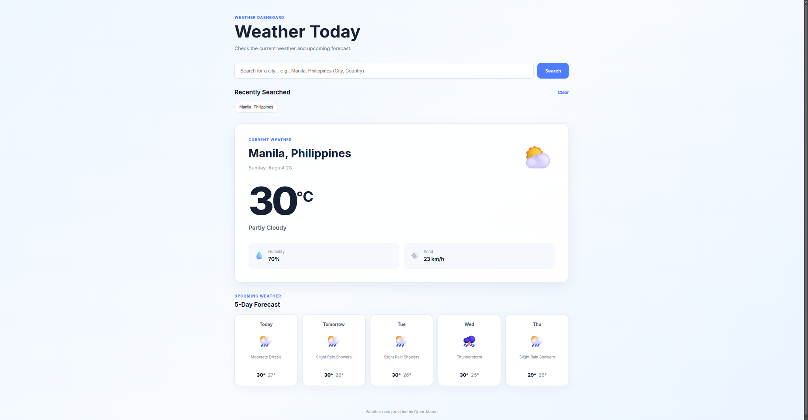
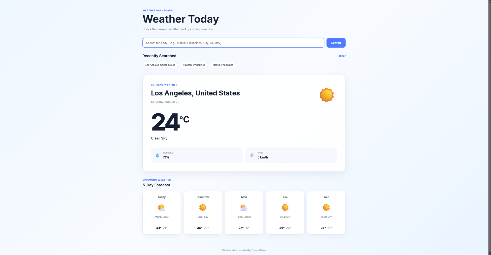
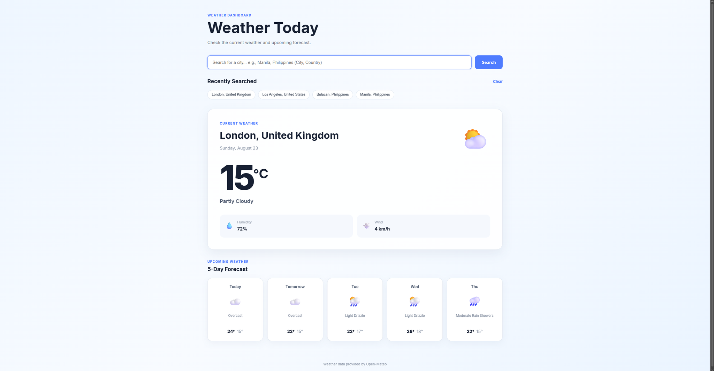
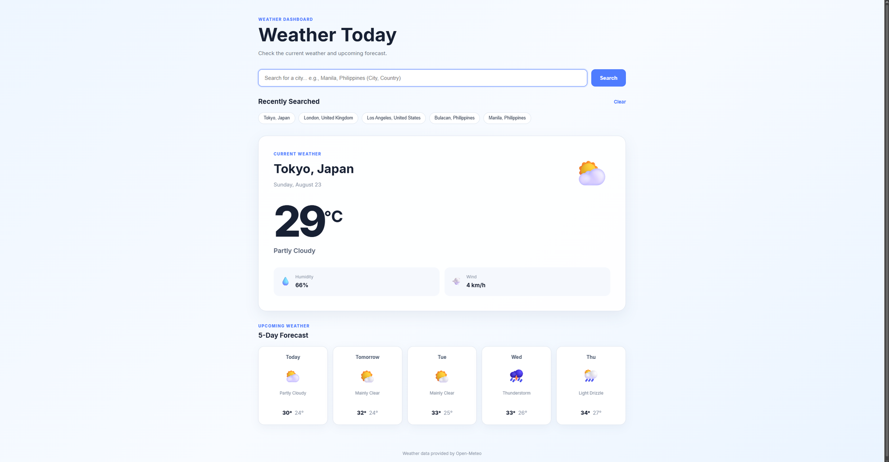

# Weather Dashboard

A responsive weather dashboard built with **HTML, CSS, and vanilla JavaScript** that consumes the **Open-Meteo REST API** to display current weather conditions and a 5-day forecast.

The application allows users to search for cities, view current weather information, browse upcoming forecasts, and quickly access recently searched cities. Recent searches are persisted using the browser's `localStorage`.

---

## Table of Contents

* [Overview](#overview)
* [Features](#features)
* [Demo](#demo)
* [Technologies Used](#technologies-used)
* [APIs Used](#apis-used)
* [How It Works](#how-it-works)
* [Project Structure](#project-structure)
* [Getting Started](#getting-started)
* [Usage](#usage)
* [Weather Information](#weather-information)
* [Recently Searched Cities](#recently-searched-cities)
* [Loading and Error Handling](#loading-and-error-handling)
* [Responsive Design](#responsive-design)
* [JavaScript Concepts Demonstrated](#javascript-concepts-demonstrated)
* [API Request Flow](#api-request-flow)
* [LocalStorage](#localstorage)
* [Future Improvements](#future-improvements)
* [What I Learned](#what-i-learned)
* [Portfolio Value](#portfolio-value)
* [Credits](#credits)
* [License](#license)

---

## Overview

The **Weather Dashboard** is a frontend web application that retrieves real-time weather information from a public weather API.

Users can enter a city name, and the application:

1. Searches for the city using the Open-Meteo Geocoding API.
2. Retrieves the city's latitude and longitude.
3. Uses those coordinates to request weather information.
4. Displays the current weather conditions.
5. Displays a 5-day weather forecast.
6. Saves the city to a list of recently searched cities.
7. Stores recent searches in `localStorage` so they remain available after refreshing the page.

The project was created to demonstrate practical JavaScript skills including **API consumption, asynchronous programming, DOM manipulation, error handling, and browser storage**.

---

## Features

### City Search

Users can search for a city using the search form.

Examples:

```text
Manila
Tokyo
London
New York
Toronto
Sydney
```

The application converts the city name into geographic coordinates before requesting the weather information.

---

### Current Temperature

The dashboard displays the current temperature in Celsius.

Example:

```text
31°C
```

---

### Weather Condition

The application displays a human-readable weather condition along with an appropriate weather emoji.

Examples:

```text
☀️ Clear Sky
⛅ Partly Cloudy
☁️ Overcast
🌧️ Moderate Rain
⛈️ Thunderstorm
```

---

### Humidity

The current relative humidity is displayed as a percentage.

Example:

```text
Humidity
72%
```

---

### Wind Speed

The current wind speed is displayed in kilometers per hour.

Example:

```text
Wind
14 km/h
```

---

### 5-Day Forecast

The dashboard displays weather information for the next five days.

Each forecast includes:

* Day
* Weather icon
* Weather condition
* Maximum temperature
* Minimum temperature

Example:

```text
Today
☀️
Clear Sky
31° / 26°

Tomorrow
⛅
Partly Cloudy
32° / 27°
```

---

### Loading State

The application displays a loading indicator while weather information is being retrieved.

This provides visual feedback to the user while asynchronous API requests are being processed.

---

### Error Handling

The application handles several possible errors, including:

* Empty city searches
* Cities that cannot be found
* Failed API requests
* Weather data retrieval errors
* LocalStorage errors

Example:

```text
City "ExampleCity" could not be found.
```

---

### Recently Searched Cities

The application stores recently searched cities.

The most recent searches appear as clickable buttons.

For example:

```text
Manila, Philippines
Tokyo, Japan
Toronto, Canada
London, United Kingdom
```

Clicking a recently searched city loads its weather without requiring the user to type the city again.

The application stores up to **five recent cities**.

---

### LocalStorage

Recently searched cities are saved using the browser's `localStorage`.

This means the search history remains available after:

* Refreshing the page
* Closing and reopening the browser
* Returning to the application later

Users can also clear their search history using the **Clear** button.

---

### Responsive Design

The interface is designed to work across different screen sizes.

Supported layouts include:

* Desktop
* Laptop
* Tablet
* Mobile phone

The forecast layout automatically changes depending on the available screen width.

---

## Demo

Check out my portfolio browser for the application screenshots!

```text
URL: https://bmarkjan-stack.github.io
```

## Desktop






---

## Technologies Used

### HTML5

Used to create the structure and semantic elements of the application.

Key concepts:

* Semantic HTML
* Forms
* Buttons
* Sections
* Accessibility labels
* HTML attributes

---

### CSS3

Used to create the visual design and responsive layout.

Key concepts:

* CSS Grid
* Flexbox
* Media queries
* CSS animations
* Responsive typography
* Transitions
* Shadows
* Gradients
* Responsive layouts

---

### JavaScript

JavaScript powers the application's functionality.

The project uses:

* Variables
* Functions
* Arrays
* Objects
* Template literals
* DOM manipulation
* Event listeners
* `fetch()`
* Promises
* `async/await`
* JSON
* Error handling
* LocalStorage

---

## APIs Used

This project uses the **Open-Meteo API**.

Open-Meteo provides weather information without requiring an API key for this project.

### Geocoding API

The application uses the Open-Meteo Geocoding API to convert a city name into geographic coordinates.

Example:

```text
Manila
```

becomes approximately:

```text
Latitude: 14.5995
Longitude: 120.9842
```

Those coordinates are then used to request weather information.

---

### Weather API

The Open-Meteo Forecast API is used to retrieve:

* Current temperature, feels-like temperature, and weather code
* Relative humidity, precipitation, and pressure
* Wind speed
* Hourly temperature, weather code, UV index, and visibility (for the
  hourly forecast and chart)
* Daily maximum/minimum temperature, weather code, sunrise, sunset,
  and max UV index

---

### Reverse Geocoding API

The **My location** feature uses BigDataCloud's free, keyless
client-side reverse geocoding API to turn the browser's GPS
coordinates into a city name. If it can't resolve a name, the app
still fetches weather for the coordinates and simply labels the
result "Current Location."

---

## How It Works

The application follows a two-step API process.

### Step 1 — Search for the City

When the user enters:

```text
Manila
```

JavaScript sends a request to the geocoding API.

```javascript
const response = await fetch(url);
```

The response is converted from JSON:

```javascript
const data = await response.json();
```

The application retrieves the city's geographic information.

---

### Step 2 — Retrieve Weather

The latitude and longitude are then passed to the weather API.

```javascript
const weatherData = await getWeather(
    location.latitude,
    location.longitude
);
```

The weather API returns JSON containing the current weather and forecast.

---

### Step 3 — Display the Data

JavaScript processes the API response and updates the HTML elements.

For example:

```javascript
currentTemperature.textContent =
    Math.round(current.temperature_2m);
```

The forecast cards are generated dynamically:

```javascript
const forecastCard =
    document.createElement("article");
```

---

### Step 4 — Save the Search

After a successful search, the city is stored in `localStorage`.

```javascript
localStorage.setItem(
    STORAGE_KEY,
    JSON.stringify(cities)
);
```

This allows the application to remember recently searched cities.

---

## Project Structure

```text
weather-dashboard/
│
├── index.html
├── styles.css
├── script.js
├── manifest.webmanifest
├── sw.js
├── icons/
│   ├── favicon-32.png
│   ├── apple-touch-icon.png
│   ├── icon-192.png
│   ├── icon-512.png
│   ├── icon-maskable-192.png
│   └── icon-maskable-512.png
├── images/
└── README.md
```

### `index.html`

Contains the application's structure.

It includes:

* Header
* Search form
* Error message
* Recently searched cities
* Loading indicator
* Current weather section
* Weather details
* Forecast section
* Footer

---

### `styles.css`

Contains all visual styling.

It controls:

* Page layout
* Colors
* Typography
* Weather cards
* Search form
* Forecast cards
* Loading spinner
* Responsive layouts
* Mobile styling

---

### `script.js`

Contains the application's functionality.

Responsibilities include:

* Searching for cities
* Calling APIs
* Processing JSON
* Displaying weather
* Generating forecasts
* Handling loading states
* Handling errors
* Managing recent searches
* Using LocalStorage

---

### `README.md`

Provides documentation for the project.

---

### `manifest.webmanifest`

Describes the app for installation: name, icons, colors, and display
mode. Lets browsers offer "Add to Home Screen" / "Install".

---

### `sw.js`

The service worker. Pre-caches the app shell on install and serves it
when the network is unavailable, so the app still opens offline.

---

### `icons/`

App icons used by the manifest and browser tab: a favicon, an Apple
touch icon, and regular plus maskable icons at 192px and 512px.

---

## Getting Started

### Prerequisites

You only need:

* A modern web browser
* VS Code or another code editor
* Internet connection

No backend server or API key is required.

---

## Installation

### 1. Clone the Repository

Clone the GitHub repository:

```bash
git clone https://github.com/YOUR-USERNAME/weather-dashboard.git
```

---

### 2. Navigate Into the Project

```bash
cd weather-dashboard
```

---

### 3. Open the Project in VS Code

```bash
code .
```

If the `code` command is unavailable, open VS Code manually and select:

```text
File → Open Folder
```

Then select the `weather-dashboard` folder.

---

## Running the Project

Because this is a frontend project, you can run it using a local development server.

### Using VS Code Live Server

If you have the **Live Server** extension installed:

1. Open `index.html`.
2. Right-click inside the file.
3. Select **Open with Live Server**.
4. Your browser will open the application.

You can then search for cities and test the weather dashboard.

---

## Usage

### Search for a City

Enter a city into the search field.

Example:

```text
Manila
```

Click:

```text
Search
```

The application will retrieve and display the weather.

---

### Search for Another City

You can search for another location at any time.

For example:

```text
Tokyo
```

The current weather and forecast will update.

---

### Use Recent Searches

Previously searched cities appear under:

```text
Recently Searched
```

Clicking a city automatically retrieves its weather information.

---

### Clear Search History

Click:

```text
Clear
```

to remove all recently searched cities from LocalStorage.

---

## Weather Information

The application interprets Open-Meteo weather codes and converts them into readable weather conditions.

Examples include:

| Weather Code | Condition            | Icon |
| -----------: | -------------------- | ---- |
|            0 | Clear Sky            | ☀️   |
|            1 | Mainly Clear         | 🌤️  |
|            2 | Partly Cloudy        | ⛅    |
|            3 | Overcast             | ☁️   |
|           45 | Fog                  | 🌫️  |
|           51 | Light Drizzle        | 🌦️  |
|           61 | Slight Rain          | 🌦️  |
|           63 | Moderate Rain        | 🌧️  |
|           65 | Heavy Rain           | 🌧️  |
|           71 | Slight Snow          | 🌨️  |
|           75 | Heavy Snow           | ❄️   |
|           80 | Rain Showers         | 🌦️  |
|           82 | Violent Rain Showers | ⛈️   |
|           95 | Thunderstorm         | ⛈️   |

This conversion is handled by the `getWeatherInfo()` function in `script.js`.

---

## Loading and Error Handling

API requests can take time or fail.

The application therefore provides feedback to the user.

### Loading

When an API request starts:

```javascript
showLoading();
```

The dashboard is hidden and a loading spinner is displayed.

The search button is also disabled temporarily.

---

### Successful Request

After the API request succeeds:

```javascript
displayWeather(
    location,
    weatherData
);
```

The weather dashboard is displayed.

---

### Failed Request

If something goes wrong:

```javascript
catch (error) {
    showError(error.message);
}
```

The application displays an appropriate error message instead of crashing.

---

## Responsive Design

The application uses CSS media queries to adapt the layout.

### Desktop

The 5-day forecast is displayed in a row:

```text
┌────────┐ ┌────────┐ ┌────────┐ ┌────────┐ ┌────────┐
│ Today  │ │ Tue    │ │ Wed    │ │ Thu    │ │ Fri    │
└────────┘ └────────┘ └────────┘ └────────┘ └────────┘
```

### Tablet

The forecast automatically wraps into multiple rows.

### Mobile

The layout changes to accommodate smaller screens.

The search form becomes vertical:

```text
┌──────────────────────────┐
│ Search for a city...     │
└──────────────────────────┘
┌──────────────────────────┐
│ Search                   │
└──────────────────────────┘
```

---

## JavaScript Concepts Demonstrated

This project was specifically designed to demonstrate practical JavaScript development skills.

### `fetch()`

The application uses `fetch()` to communicate with external APIs.

```javascript
const response = await fetch(url);
```

---

### REST APIs

The project communicates with REST endpoints to retrieve geographic and weather data.

---

### Promises

API requests return promises, which are handled using `async/await`.

---

### `async/await`

The application uses asynchronous functions:

```javascript
async function getWeather(latitude, longitude) {
    const response = await fetch(url);

    return await response.json();
}
```

This makes asynchronous code easier to read and maintain.

---

### JSON

API responses are converted into JavaScript objects:

```javascript
const data = await response.json();
```

The application then accesses properties from those objects.

---

### DOM Manipulation

JavaScript dynamically updates the page:

```javascript
temperatureElement.textContent = temperature;
```

Forecast cards are also generated dynamically.

---

### Event Listeners

The application responds to user interactions.

For example:

```javascript
searchForm.addEventListener(
    "submit",
    async (event) => {
        // ...
    }
);
```

Recent city buttons also receive click event listeners.

---

### Error Handling

The application uses `try...catch...finally`:

```javascript
try {
    // API request
} catch (error) {
    // Handle error
} finally {
    // Stop loading
}
```

This demonstrates how real applications handle unreliable network requests.

---

### LocalStorage

The project uses browser storage:

```javascript
localStorage.setItem(
    STORAGE_KEY,
    JSON.stringify(cities)
);
```

and:

```javascript
localStorage.getItem(STORAGE_KEY);
```

This allows data to persist between sessions.

---

## API Request Flow

The complete request process is:

```text
┌───────────────────────┐
│ User enters city      │
│ "Manila"              │
└───────────┬───────────┘
            │
            ▼
┌───────────────────────┐
│ Geocoding API         │
│ Search city           │
└───────────┬───────────┘
            │
            ▼
┌───────────────────────┐
│ Latitude / Longitude  │
│ 14.x / 120.x          │
└───────────┬───────────┘
            │
            ▼
┌───────────────────────┐
│ Weather API           │
│ Current + Forecast    │
└───────────┬───────────┘
            │
            ▼
┌───────────────────────┐
│ JSON Response         │
└───────────┬───────────┘
            │
            ▼
┌───────────────────────┐
│ JavaScript            │
│ Processes Data        │
└───────────┬───────────┘
            │
            ▼
┌───────────────────────┐
│ DOM Updated            │
│ Weather Dashboard      │
└───────────┬───────────┘
            │
            ▼
┌───────────────────────┐
│ City saved to          │
│ LocalStorage           │
└───────────────────────┘
```

---

## LocalStorage

The application uses the following storage key:

```javascript
const STORAGE_KEY =
    "weatherDashboardRecentCities";
```

The stored data is an array of city objects.

Conceptually, it looks like:

```json
[
    {
        "name": "Manila",
        "country": "Philippines",
        "latitude": 14.5995,
        "longitude": 120.9842
    }
]
```

The application limits the history to five cities.

```javascript
cities = cities.slice(0, MAX_RECENT_CITIES);
```

This prevents the recently searched list from growing indefinitely.

---

## Future Improvements

The improvements originally listed here have now been implemented.
Each one is described below, in the same order as the original list.

---

### 1. Current Location

Click **My location** next to the search field to request the browser's
geolocation permission. The coordinates are reverse-geocoded (via the
free BigDataCloud client-side API, no key required) into a city name,
then handled through the same weather pipeline as a typed search.

If location access is denied or unavailable, an inline error explains
what happened instead of failing silently.

---

### 2. Temperature Unit Toggle

A `°C` / `°F` switch sits in the header. The choice is saved to
`localStorage` and reapplied on the next visit. Switching units
re-renders the current temperature, hourly forecast, chart, and 5-day
forecast from the already-loaded data — no extra API call.

---

### 3. More Weather Details

The current-weather card now also shows:

* Feels-like temperature
* Sunrise and sunset
* UV index, with a Low / Moderate / High / Very High / Extreme label
* Visibility
* Precipitation
* Pressure

These come from Open-Meteo's `current`, `hourly`, and `daily` variables
(`apparent_temperature`, `uv_index`, `visibility`, `precipitation`,
`pressure_msl`, `sunrise`, `sunset`).

---

### 4. Hourly Forecast

A horizontally scrollable row shows the next 24 hours, each with a
time, icon, and temperature. The card for the current hour is labeled
**Now** and visually highlighted.

---

### 5. Weather Charts

The same 24-hour window is plotted as a temperature line chart,
drawn as plain inline SVG (no charting library, so it stays fully
self-contained and works offline). It includes a hidden text summary
for screen readers.

---

### 6. Dark Mode

A theme toggle in the header switches between light and dark palettes.
The choice is saved to `localStorage`; if none is saved yet, the app
follows the operating system's `prefers-color-scheme`.

---

### 7. Weather-Based Backgrounds

The page background tints to match current conditions and day/night:

```text
Clear (day)    → Bright sky blue
Clear (night)  → Deep indigo
Cloudy / Fog   → Soft grey
Rain           → Cool blue-grey
Snow           → Pale ice blue
Thunder        → Muted violet-grey
```

Every combination of background and theme was checked against the
app's text colors for WCAG AA contrast before being added.

---

### 8. Search Suggestions

Typing two or more characters into the search field queries the
Open-Meteo geocoding API (debounced, with in-flight requests cancelled
via `AbortController`) and shows up to five matching cities with their
region and country. The field is built as an accessible combobox:
arrow keys move through the list, Enter selects, Escape closes, and
the active option is announced through `aria-activedescendant`.

---

### 9. Better Accessibility

Beyond the combobox pattern above:

* A skip link jumps straight to the weather content.
* A visually hidden `aria-live` region announces loading, success,
  offline, and location-request states for screen reader users,
  separate from the visible (and `role="alert"`) error message.
* All icon-only buttons (unit toggle, theme toggle, install, My
  location) have descriptive `aria-label`s, and toggles expose
  `aria-pressed`.
* Visible focus outlines are used throughout instead of suppressing
  the browser default.
* Every text/background pairing, including the weather-based
  backgrounds and both themes, was checked for WCAG AA contrast.
* `prefers-reduced-motion` is respected by shortening animations.

---

### 10. Progressive Web App

The app now ships with:

* A `manifest.webmanifest` (installable, with regular and maskable
  icons) so it can be added to the home screen or app dock.
* An install button that appears when the browser's
  `beforeinstallprompt` fires.
* A service worker (`sw.js`) that pre-caches the app shell (HTML, CSS,
  JS, icons) so the interface still loads offline.
* Cached weather: the most recently loaded weather is saved to
  `localStorage`. If a later request fails while offline, the app
  shows that saved weather with a banner noting when it was saved,
  instead of just showing an error.


## What I Learned

Building this project helped reinforce several important frontend development concepts.

### Working with External APIs

I learned how to communicate with third-party APIs and process the data returned by them.

### Asynchronous JavaScript

I practiced using `async/await` and promises to handle operations that don't complete immediately.

### JSON Data

I learned how to navigate and use structured JSON responses.

### DOM Manipulation

I practiced updating existing elements and dynamically creating forecast cards.

### Error Handling

I learned how to make an application handle invalid searches and failed network requests gracefully.

### Browser Storage

I practiced using LocalStorage to persist information between browser sessions.

### Responsive Design

I learned how to create an interface that adapts to desktop, tablet, and mobile screens.

---

## Portfolio Value

**Portfolio Rating: ⭐⭐⭐⭐⭐**

This project demonstrates that I can build more than static webpages.

It demonstrates practical knowledge of:

```text
HTML
CSS
JavaScript
       │
       ├── DOM Manipulation
       ├── Events
       ├── Async/Await
       ├── Fetch API
       ├── REST APIs
       ├── JSON
       ├── Error Handling
       └── LocalStorage
```

It also demonstrates the ability to work with a real external data source and turn API data into an interactive user interface.

This makes the project particularly useful as an entry-level frontend portfolio project.

---

## Credits

Weather information is provided by **Open-Meteo**.

Open-Meteo provides weather forecast and geocoding APIs used by this application.

* Open-Meteo Weather API
* Open-Meteo Geocoding API

No API key is required for the implementation used in this project.

---

## License

This project is available for educational and portfolio purposes.

You are welcome to modify the code and use the project as part of your personal developer portfolio.

---

## Author

**Mark Jan Bautista**

Aspiring Web Developer

### Skills Demonstrated

* HTML5
* CSS3
* JavaScript
* REST APIs
* Fetch API
* Async/Await
* JSON
* DOM Manipulation
* LocalStorage
* Responsive Web Design

### GitHub

```text
https://github.com/bmarkjan-stack
```

### Project Repository

```text
https://github.com/bmarkjan-stack/weather-dashboard
```
